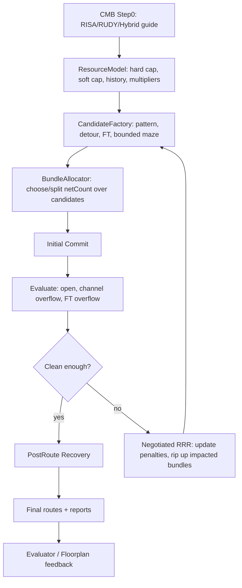

# Router Rewrite Blueprint

最後更新：2026-06-01

這份文件是為了重寫 Problem E main router 而整理的實作導向設計書。它不是單純的 paper survey，而是把目前 CMB 架構、Problem E 的特殊資源模型、routing 論文與開源 router 的啟發整理成可以逐步開工的 blueprint。

目前的 `Router.cpp` 應該被保留為 baseline 與 regression reference。新的 router 建議先以獨立架構加入，等它在 open route、channel overflow、feedthrough overflow、wire length 上穩定優於 baseline 後，再決定是否取代舊 router。

## 1. 核心定位

Problem E 不是標準 IC global routing。比較接近的心智模型是：

```text
early floorplan channel graph
  + FPGA-style negotiated resource routing
  + IC-style pattern/candidate routing
  + bundle allocation for netCount
  + feedthrough-aware soft-block resource management
```

目前 baseline router 已經比單純 shortest-path router 強很多，但本質上仍是 sequential / path-greedy：

- 一次 route 一條 connection；
- CMB 主要只當靜態 cost guide；
- 沒有全局地在多個 route candidates 之間選擇；
- split 邏輯有限，還不是完整 bundle allocator；
- 沒有真正的 negotiated rip-up and reroute loop；
- channel overflow 與 soft-block feedthrough overflow 都是間接修正。

Router V2 的核心轉變應該是：**CMB 負責預測壓力，main router 負責資源協商與分配。**

建議的頂層架構：

```text
CMB Step0
  -> ResourceModel
  -> CandidateFactory
  -> BundleAllocator / InitialRouter
  -> Negotiated Rip-up & Reroute
  -> Local Repair / Box Expansion
  -> PostRoute Recovery
  -> Evaluator + CMB/Floorplan Feedback
```

## 2. Problem E Resource Model

新的 router 必須比目前 `Channel.usedNets/capacity/overflow` 更明確地建模 routing resource。

### 2.1 Channel Direction Resources

每個 channel 應該拆成兩個方向性 resource：

```text
ChannelResource(channelId, LR)
ChannelResource(channelId, TB)
```

語意：

- `LR`：水平通過，edge 1 <-> edge 3，capacity = channel height * 25。
- `TB`：垂直通過，edge 2 <-> edge 4，capacity = channel width * 25。
- 若 path 在 channel 裡轉彎，會同時消耗 `LR` 與 `TB`。

目前 baseline 已經有 directional usage 的概念。Router V2 應該把它提升成第一級 resource state：

```cpp
struct ResourceState {
    ResourceId id;
    double hardCap;
    double softCap;
    double demand;
    double presentPenalty;
    double historyPenalty;
    double multiplier;
    double cmbAmbientDemand;
    double cmbCriticality;
};
```

重要區分：

- `hardCap`：題目真正的容量限制。
- `softCap`：考慮 reservation / CMB 風險後的早期 routing 容量。
- 最終合法性必須用 `hardCap` 判斷，不能只看 `softCap`。

### 2.2 Soft Block Feedthrough Resources

Hard block 與 edge block 是 obstacle，不能被中繼穿越。Soft block 可以作為 intermediate feedthrough，但會增加 area，並可能造成 feedthrough overflow。

每個 soft block 應該被表示成：

```text
SoftFTResource(blockId)
```

需要追蹤：

- 目前 `ftUsed`；
- 新增 `q` nets 的 incremental area；
- projected `ftOverflowArea`；
- historical FT pressure；
- block edge 附近的 CMB access risk。

這個 resource 應該像 V-GR / CUGR 裡的 via 或特殊 resource 一樣被定價，而不是免費的幾何捷徑。

### 2.3 Block Edge Access Resources

CMB 已經有 block-edge pressure。Router V2 應該把這些壓力帶入 routing cost：

```text
BlockAccessResource(blockId, edge)
```

V1 不一定要把它做成 hard capacity，可以先作為 soft cost：

- endpoint bottleneck risk 高時，提高離開 / 進入該 edge 的 cost；
- 若某個 block edge 反覆導致 open route，增加 history；
- local repair 可以針對這些 edge 修。

這點很重要，因為很多 open route 不是全局 path 找不到，而是 endpoint access 被卡住。

### 2.4 Candidate-Level Usage Delta

每個 candidate path 在 commit 前都要能分析它會吃哪些 resource：

```cpp
struct ResourceDelta {
    vector<pair<ResourceId, double>> channelUse;
    vector<pair<ResourceId, double>> ftUse;
    vector<pair<ResourceId, double>> accessUse;
    double wireLength;
    int turnCount;
    int softFTBlockCount;
};
```

Resource model 應支援：

```cpp
double marginalCost(const ResourceDelta& delta, int quantity) const;
bool feasibleHard(const ResourceDelta& delta, int quantity) const;
bool feasibleSoft(const ResourceDelta& delta, int quantity) const;
void commit(const ResourceDelta& delta, int quantity);
void ripup(const ResourceDelta& delta, int quantity);
```

這是 bundle splitting 與 negotiated reroute 的基礎。

## 3. CMB Integration

目前 CMB 已經足夠強，應該直接成為 Router V2 的 upstream estimator。不要重寫 CMB，應該把它的輸出提升成 router priors。

### 3.1 Router 應使用的 CMB 訊號

來自 `Step0ChannelPressure`：

- `capLR`, `capTB`
- `effectiveCapLR`, `effectiveCapTB`
- `ambientDemandLR`, `ambientDemandTB`
- `routerCriticalityLR`, `routerCriticalityTB`
- `hybridDemandLR`, `hybridDemandTB`
- `risaDemandLR`, `risaDemandTB`
- `rudyDemandLR`, `rudyDemandTB`
- `regionId`

來自 `Step0ConnectionGuide`：

- `routePriority`
- `selectedPattern`
- `preferredChannelIndices`
- `avoidChannelIndices`
- `patternGuideStrength`
- `patternGuideMode`
- `endpointAccessRisk`
- `endpointBottleneckRisk`
- `sharedBottleneckRisk`
- `commonBottleneckChannelIndices`
- `lackOfAlternative`
- `openRiskScore`
- `openRiskType`
- `channelOnlyConnected`
- `ftEnabledConnected`

來自 `Step0BlockEdgePressure`：

- `edgePressure`
- `edgeSupply`
- `incidentDemandEstimate`
- access channel health 相關欄位

### 3.2 Router 應回饋給 CMB

每輪主要 router iteration 後，Router V2 應輸出一份內部 feedback snapshot：

```cpp
struct RouterFeedback {
    vector<double> actualLR;
    vector<double> actualTB;
    vector<double> overflowLR;
    vector<double> overflowTB;
    vector<double> ftUsedByBlock;
    vector<double> ftOverflowByBlock;
    vector<int> openConnectionIds;
    vector<int> highHistoryChannelIds;
};
```

MVP 階段不一定要讓 CMB 真的 consume 它，可以先輸出 CSV/report。V2 再讓 CMB 用它更新 `histLR/histTB`、floorplan move hints、region scores。

## 4. Proposed Router Pipeline



最重要的設計轉變：

```text
Current baseline:
  route one connection -> accept/reject -> maybe split -> move on

Router V2:
  generate candidates -> allocate bundle quantities -> negotiate resources -> repair locally
```

## 5. Module Blueprint

### 5.1 `RoutingResourceModel`

職責：

- 從 `Design.channels` 建 channel LR/TB resources；
- 從 soft blocks 建 FT resources；
- 匯入 CMB effective capacity、ambient demand、criticality；
- 追蹤 committed demand；
- 計算 present/history/multiplier cost；
- 支援 commit/rip-up；
- 輸出 debug tables。

建議檔案：

```text
RoutingResourceModel.hpp
RoutingResourceModel.cpp
```

核心 API 草圖：

```cpp
class RoutingResourceModel {
public:
    void initialize(const Design& design, const Step0CongestionMapResult& cmb);
    ResourceDelta analyzePath(const RoutePath& path, int connIndex) const;

    double candidateCost(const ResourceDelta& delta, int quantity, double wlWeight) const;
    bool hardFeasible(const ResourceDelta& delta, int quantity) const;
    bool softFeasible(const ResourceDelta& delta, int quantity) const;

    void commit(int connIndex, int candidateId, const ResourceDelta& delta, int quantity);
    void ripup(int connIndex);

    void updatePresentCosts();
    void updateHistoryAndMultipliers();

    vector<int> overflowingChannels() const;
    vector<int> overflowingSoftBlocks() const;
};
```

論文 / source anchors：

- PathFinder / VPR：present + historical negotiated cost。
- HeLEM-GR：multiplier-based overflow pressure。
- SPRoute 2.0：由 congestion estimate 產生 soft capacity。
- Capacity Reduction Techniques：obstacle/pin 附近的 resource reservation。
- CUGR / V-GR：detailed-routability-aware dynamic resource cost。

### 5.2 `RouteCandidate`

candidate 不應只是 `RoutePath`，還要包含預估 cost 與 resource usage。

```cpp
struct RouteCandidate {
    int id = -1;
    int connIndex = -1;
    string generator;       // CMB_PATTERN, L, Z, C, THREE_BEND, FT, MAZE, REPAIR
    RoutePath path;
    ResourceDelta delta;

    double baseWireLength = 0.0;
    double cmbScore = 0.0;
    double cost = 0.0;
    double maxProjectedUtil = 0.0;
    double projectedOverflow = 0.0;
    double projectedFTOverflow = 0.0;

    bool usesSoftFT = false;
    bool channelOnly = true;
    bool legalGeometry = true;
    bool hardFeasible = false;
    bool softFeasible = false;
};
```

### 5.3 `CandidateFactory`

職責：

- 對每條 connection 產生 K 個 route candidates；
- 使用 CMB guide 當 preference，而不是 hard route；
- 同時提供 channel-only 與 FT-enabled alternatives；
- 在 RRR stall 後支援 candidate expansion。

候選類型：

1. CMB selected-pattern candidate。
2. Direct L candidates。
3. Z candidates。
4. 繞開一個 congested region 的 C / detour candidates。
5. Three-bend candidates。
6. Monotone staircase candidates。
7. 經過 soft block 的 FT-assisted candidates。
8. Bounded A*/maze candidates。
9. Local repair box 內產生的 candidates。

生成策略：

```text
normal connection:
  CMB pattern + 2 L + small Z/C set

large netCount:
  wider K, include split-friendly alternatives

endpoint/open risk:
  include alternate block edges and FT candidates earlier

shared bottleneck risk:
  include detour candidates around common bottleneck channels

capacity risk:
  include bounded maze / box-expanded candidates earlier
```

DGR 的啟發：

- 把 candidates 看成小型 DAG forest。
- 以目前 Problem E 的 two-terminal connections 來看，可以先從 flat candidate pool 做起。
- 若未來 input 變成 multi-pin nets，再升級成完整 topology candidates。

論文 / source anchors：

- DGR：DAG forest 與 global candidate selection。
- EDGE / CU-GR-2：pattern route -> detour -> sparse maze。
- FastRoute / FastRoute 4.0：L/Z/3-bend 與 congestion-driven topology。
- STAIRoute：early floorplan 的 monotone staircase routing。
- V-GR：dynamic turn/via-like cost 與 multi-strategy candidates。
- OARSMT papers：繞開 hard/edge blocks 的 obstacle-aware candidates。

### 5.4 `BundleAllocator`

Problem E 的 connections 是 bundle：`netCount` 可能很大。把一整個 connection 當成不可拆的一條 path 太粗。

職責：

- 決定 connection 要 single-path 還是 split；
- 把 quantity 分配到 candidates；
- 最小化 marginal overflow 與 FT cost；
- 輸出一條或多條 `RoutePath`，且它們的 `netCount` 總和等於 connection demand。

MVP 策略：

```text
if netCount <= smallThreshold and low risk:
    choose cheapest feasible candidate
else:
    split into chunks and assign chunks by marginal cost
```

Greedy marginal allocator：

```text
remaining = conn.netCount
while remaining > 0:
    for each candidate:
        compute marginalCost(candidate, chunk)
    choose best candidate
    assign chunk
    commit temporary demand
    remaining -= chunk
```

重要：split 只有在真的降低 bottleneck pressure 時才應接受。若大部分 chunks 仍打到同一個 saturated channel component，應判定為 fake split 並拒絕。

V2 local ILP：

- 對 congested box 或 high-risk bundle 建 Sidewinder-style candidate selection problem。
- 小 bundle 可以用 binary variables；大 bundle 可以用 integer quantities。
- HiGHS/OR-Tools 只用在 local problem，不要一開始做 full-chip ILP。

論文 / source anchors：

- Sidewinder：每條 net 少量 candidates、scalable ILP、no-worse-than-current iteration。
- Multicommodity-flow approximation：用 fractional view 理解 congestion pressure。
- GRIP/PGRIP：candidate routes 的 IP selection。
- Integrated Floorplanning with BufferChannel Insertion：bus-like demand 的 route option generation / selection。

### 5.5 `InitialRouter`

initial router 不應只照 `netCount` 排序。應該先 route 低彈性、高風險的 connections。

建議 priority：

```text
priority =
  4.0 * openRiskScore
+ 3.0 * endpointBottleneckRisk
+ 3.0 * sharedBottleneckRisk
+ 2.0 * lackOfAlternative
+ 1.5 * routePriority
+ 1.0 * normalizedNetCount
- 1.0 * candidateDiversity
```

直覺：

- bottleneck-sensitive connections 要早於 flexible connections；
- large bundles 很重要，但應排在 access/risk 後面；
- `candidateDiversity` 可以避免太早把容量花在本來就有很多替代路徑的 connection。

論文 / source anchors：

- Multi-layer routing with via/wire capacity：least-flexibility-first。
- NTHU-Route 2.0：reroute ordering 很重要。
- SPRoute 2.0：deterministic scheduling and batch control。
- ICCAD 2024 chip-level router：實用 ordering 與 tree-as-source routing。

### 5.6 `NegotiatedRouter`

這是重寫 router 的核心。

職責：

- 偵測 overflow / open / FT violations；
- 更新 resource penalties；
- 選擇 impacted connections 進行 rip-up；
- regenerate 或 expand candidates；
- 重新執行 bundle allocation；
- 根據 convergence criteria 停止。

Cost model：

```text
candidateCost =
    wlWeight * wireLength
  + turnWeight * turnCount
  + cmbCriticalityCost
  + presentCongestionCost
  + historyCost
  + multiplierCost
  + ftIncrementalAreaCost
  + ftOverflowCost
  + accessRiskCost
  + detourPenalty
```

Resource penalty 草圖：

```text
projected = demand + quantity * usage + cmbAmbientDemand
softOverflow = max(0, projected - softCap)
hardOverflow = max(0, projected - hardCap)

presentCost = p0 * utilizationCurve(projected / softCap)
historyCost = history * softOverflow
multiplierCost = lambda * hardOverflow
```

Multiplier update 選項：

1. PathFinder-style：

```text
if resource overflowed:
    history += historyStep * overflow
present = presentBase * currentOveruse
```

2. HeLEM-inspired：

```text
lambda_r *= exp(rho * overflow_r / max(1, hardCap_r))
rho = min(rhoMax, rho * rhoGrowth)
```

MVP 建議：

- 先實作 PathFinder-style history；
- 等 resource accounting 穩定後，再加 HeLEM exponential multiplier。

Rip-up candidate set：

- open connections；
- 使用 overflown channel components 的 connections；
- 使用 overflown soft FT blocks 的 connections；
- 使用 top-N high-history channels 的 connections；
- 同一 CMB region 裡 `sharedBottleneckRisk` 高的 connections；
- 對 overflow marginal contribution 高的大 bundles。

Iteration schedule：

```text
Round 0:
  route with soft capacity and FT expensive

Round 1-3:
  rip up overflow contributors
  update history
  allow more Z/C/3-bend candidates

Round 4-8:
  enable FT candidates for capacity-open or detour-heavy nets
  relax detour bound
  use bounded maze candidates

Round 9+:
  local repair boxes
  allow hard-cap overflow only if all no-open options fail
```

Termination：

- 沒有 open routes；
- channel overflow 為 0，或 N 輪沒有改善；
- FT overflow 為 0，或 N 輪沒有改善；
- 達到 max iteration；
- last-gasp repair 完成。

論文 / source anchors：

- PathFinder / VTR / RWRoute：negotiated resource routing。
- HeLEM-GR：linearized exponential multiplier 加速 overflow reduction。
- FGR：Lagrangian cost 與 last-gasp routing。
- NTHU-Route 2.0：穩定 history-based cost 與 reroute ordering。
- NCTU-GR / NCTU-GR 2.0：staged RRR 與 bounded-length maze。
- SPRoute / SPRoute 2.0：deterministic parallel RRR 與 livelock control。

### 5.7 `LocalRepairRouter`

Global RRR 會在某些 case 卡住。Local repair 負責處理殘留問題。

Repair types：

1. Channel overflow repair。
2. Soft FT overflow repair。
3. Open connection repair。
4. Endpoint access repair。
5. Region-level bottleneck repair。

建議流程：

```text
for each bad region:
    build repair box around overflown channels / open endpoints
    rip up selected contributors
    regenerate candidates constrained to or detouring around the box
    try greedy allocation
    if still bad and region size is small:
        run local Sidewinder/HiGHS selection
    expand box and retry
```

Box expansion policy：

- 從 CMB congested region bbox 開始；
- 對 open routes 納入 endpoint blocks；
- 納入 adjacent high-history channels；
- 每次失敗擴張一層 channel；
- 設上限，避免 local ILP 變成 full-chip ILP。

特殊 FT repair：

- 找出 `ftOverflowArea` 高的 soft blocks；
- rip up 使用該 block 作為 intermediate FT 的 paths；
- 強制產生避開該 block 的 alternatives；
- 只有在 FT 能避免更糟的 channel overflow 或 open route 時才保留。

論文 / source anchors：

- BoxRouter / BoxRouter 2.0：progressive box expansion 與 local ILP。
- EDGE / CU-GR-2：detour generation before sparse maze。
- CUGR：pin regions、long segments、violations 的 patching。
- V-GR：local monotonic first，global expanded-source maze later。
- Starfish：A*-based partial rerouting。
- qrouter / Dr. CU：實務 windowed repair 與 sparse-grid thinking。

### 5.8 `PostRouteRecovery`

可行性改善後，要追回 quality。

任務：

- merge 最終走到同一路徑的 split routes；
- 移除 dominated split candidates；
- 若不重新造成 overflow，把小 detour route 回便宜 pattern；
- 當 channel-only alternative 可用時，降低 FT usage；
- edge retraction / route shortening；
- 移除 dead loops 或多餘 intermediate steps；
- 重新計算 exact directional usage。

論文 / source anchors：

- MaizeRouter：edge shifting、retraction、defragmentation。
- FGR：last-gasp and resource recovery。
- CUGR / V-GR：patching and post-route cleanups。

## 6. MVP Scope

不要一次實作整份 blueprint。第一版 Router V2 只做最能改變結果的核心。

### MVP Must Have

1. `RoutingResourceModel`
   - channel LR/TB resources；
   - CMB effective capacity / ambient demand 形成 soft capacity；
   - FT resource accounting；
   - commit/rip-up。

2. `CandidateFactory`
   - CMB selected pattern；
   - L/Z/3-bend candidates；
   - 一組 FT-assisted candidate family；
   - bounded maze fallback。

3. `BundleAllocator`
   - small/low-risk connections 用 single-path；
   - large/high-risk connections 用 greedy split；
   - fake-split rejection。

4. `NegotiatedRouter`
   - PathFinder-style history；
   - impacted-connection rip-up；
   - dynamic candidate expansion；
   - no-open priority before wirelength recovery。

5. Debug/reporting
   - per-iteration open count；
   - channel LR/TB overflow；
   - FT overflow；
   - top overflown resources；
   - top connections contributing to each bad resource。

### MVP Should Not Have Yet

- full differentiable DGR solver；
- full-chip ILP；
- GPU acceleration；
- complete floorplanner feedback loop；
- advanced parallel RRR；
- multi-pin topology forest，除非 testcase 真的需要。

這些都很有價值，但應放到第二階段。

## 7. File-Level Implementation Plan

保持 baseline router 完整。Router V2 先加在旁邊。

建議檔案：

```text
RouterV2.hpp
RouterV2.cpp
RoutingResourceModel.hpp
RoutingResourceModel.cpp
RouteCandidate.hpp
CandidateFactory.hpp
CandidateFactory.cpp
BundleAllocator.hpp
BundleAllocator.cpp
NegotiatedRouter.hpp
NegotiatedRouter.cpp
LocalRepairRouter.hpp
LocalRepairRouter.cpp
RouteDebugReport.hpp
RouteDebugReport.cpp
```

最小整合：

```cpp
class RouterV2 {
public:
    void route(Design& design);
};
```

之後可在 `main.cpp` 或 `Router.hpp` 加 switch：

```text
baseline router
router_v2
```

在 Router V2 有 regression numbers 前，不要刪除或重寫 `Router.cpp`。

## 8. Implementation Phases

### Phase 0: Invariants and Metrics

在改演算法前，先集中或新增檢查：

- 每個 route step 都引用存在的 block/channel；
- hard/edge blocks 絕不能當 intermediate feedthrough；
- 每個 intermediate rectangle 都有合法 in/out edges；
- split 後 route `netCount` 總和必須等於 connection demand；
- 從 routes 重算的 directional channel usage 必須等於 resource model demand；
- 從 routes 重算的 FT usage 必須等於 block `ftUsed`；
- evaluator 和 router 對 overflow 的定義一致。

Deliverable：

```text
route_v2_iteration_report.csv
route_v2_resource_report.csv
route_v2_connection_report.csv
```

### Phase 1: ResourceModel + CandidateFactory

先建 resources 並產生 candidates，但還不取代最終 router。

Deliverable：

- 每條 connection 的 candidate count 與 best candidate cost；
- candidate feasibility 與目前 baseline path 對照；
- top missing-candidate cases report。

### Phase 2: Initial Router + Greedy BundleAllocator

用 candidate selection 與 greedy split route 所有 connections。

目標：

- open count 不比 baseline 差；
- case30 / case50 channel overflow 下降；
- route count 不爆炸。

### Phase 3: Negotiated RRR

加入 history-based rip-up/reroute。

目標：

- 降低剩餘 channel overflow；
- 減少 fake splits；
- iterations 穩定且 deterministic。

### Phase 4: FT-Aware Repair

加入明確的 soft-block FT relief 與 local repair。

目標：

- 降低 FT overflow；
- 不因修 FT 而打開太多 open routes；
- 避免 soft block 被當成預設捷徑。

### Phase 5: Local ILP / Box Repair

上述都穩後，再加入 Sidewinder-style local candidate selection。

目標：

- 修掉殘留 congested boxes；
- 改善最難的 case50 behavior。

### Phase 6: Quality Recovery

可行性穩定後，再縮短與簡化 routes。

目標：

- 降低 wire length；
- 降低 split path 數量；
- 保持 overflow 不回升。

## 9. Paper Mapping

### Resource Model / Capacity Reservation

- SPRoute 2.0：根據 congestion estimate 做 soft capacity。
- A Fast and Robust Global Router with Capacity Reduction Techniques：initial / 2D / 3D capacity reduction and patching。
- CUGR：probability-based resource model 與 detailed-routability-driven cost。
- Optimizing Detailed-Routability for 3D Global Routing：dynamic resource model 與 routability-aware cost。
- Multi-layer global routing considering via and wire capacities：multi-resource capacity thinking。
- V-GR：dynamic via-like cost，可轉成 turn / FT pricing。

Problem E 對應：

- soft channel cap = CMB effective cap / capacity reduction；
- FT reserve = soft block area margin；
- block-edge reserve = endpoint access pressure。

### Candidate Generation

- DGR：DAG forest 與 candidate probability view。
- EDGE / CU-GR-2：pattern route、detour、sparse maze。
- FastRoute / FastRoute 4.0：L/Z/3-bend 與 congestion-driven Steiner/topology。
- STAIRoute：early floorplan 的 monotone staircase resources。
- V-GR：local monotonic 與 3-via-stack-like alternatives。
- OARSMT papers：obstacle-aware routes around hard/edge blocks。

Problem E 對應：

- 預設生成 compact K candidates；
- 只對 congested/open regions 擴張 candidate set；
- FT candidates 要有意識地生成，不要當預設 fallback。

### Bundle Allocation / Global Selection

- Sidewinder：small candidate pool + ILP selection + no-worse iterations。
- Multicommodity-flow approximation：fractional congestion pressure。
- GRIP/PGRIP：IP-based candidate selection。
- Integrated Floorplanning with BufferChannel Insertion：bus-like route options。

Problem E 對應：

- 大 `netCount` connections 可拆到多個 route candidates；
- local ILP 只用在 congested boxes 或 large bundles。

### Negotiated RRR

- PathFinder：negotiated present/history cost。
- VTR/VPR：實務 resource graph 與 route tree implementation。
- RWRoute：commercial-FPGA connection-based negotiated routing。
- HeLEM-GR：exponential multiplier 更快降低 overflow。
- NTHU-Route 2.0：stable history cost 與 reroute ordering。
- NCTU-GR / NCTU-GR 2.0：simulated evolution、bounded-length maze、dynamic history。
- FGR：Lagrangian framework 與 last-gasp routing。
- SPRoute / SPRoute 2.0：deterministic parallel RRR 與 livelock-aware scheduling。

Problem E 對應：

- channel LR/TB 與 FT 都是 negotiable resources；
- overflow resources 應在 iterations 中逐漸變貴；
- rip-up 應集中在 actual contributors，而不是每輪全拆。

### Local Repair / Recovery

- BoxRouter / BoxRouter 2.0：progressive box expansion 與 local ILP。
- CUGR：pin regions、long segments、violations 的 patching。
- V-GR：multi-strategy local/global repair。
- MaizeRouter：edge shifting、retraction、defragmentation。
- Starfish：A*-based partial rerouting。
- qrouter / Dr. CU：實務 windowed repair behavior。

Problem E 對應：

- 先修 overflown CMB regions；
- 獨立修 FT-overflow soft blocks；
- post-route recovery 要回收不必要 detour 與 FT usage。

### Parallel / Runtime

- FastGR：CPU-GPU task graph scheduling 與 conflict-aware batches。
- InstantGR：scalable GPU parallelization 與簡化 capacity format。
- CUFR / Open-source FPGA parallel router：recursive partitioning ternary tree。
- SPRoute 2.0：deterministic bulk synchronous batching。

Problem E 對應：

- MVP 先保持 deterministic serial；
- correctness 穩定後再加 parallel batches。

## 10. Open-Source Mapping

優先檢查的 code/resources：

1. CU-GR-2 / EDGE
   - 看 `GlobalRouter`、DAG construction、detour stage、sparse maze stage。

2. CUGR original
   - 看 probabilistic resource cost、patch generation、local graph building。

3. VTR / VPR
   - 看 resource graph、present/history cost、route tree、rip-up bookkeeping。

4. RapidWright / RWRoute
   - 看 connection-based routing、resource sharing、negotiated cost in commercial-FPGA graph。

5. OpenROAD FastRoute
   - 看 pattern routing、capacity adjustment、congestion iteration。

6. HiGHS / OR-Tools / LEMON
   - 看未來 Sidewinder-style local repair 的 optimization API。

不要直接 port 任何完整 router。Problem E 的 route format 和 resource model 很特殊。

## 11. Debugging and Evaluation

Router V2 需要比 baseline 更多 introspection。

### Per Iteration Metrics

```text
iter
openRouteCount
totalChannelOverflow
maxChannelOverflow
overflowChannelCount
totalFTOverflowArea
overflowSoftBlockCount
totalWireLength
routeCount
splitConnectionCount
avgCandidateCount
rippedConnectionCount
```

### Per Resource Debug

每個 channel component：

```text
channelName
component
hardCap
softCap
cmbAmbientDemand
actualDemand
overflow
history
multiplier
topContributorConnections
```

每個 soft block：

```text
blockName
ftUsed
incrementalArea
ftOverflowArea
topContributorConnections
avoidanceCandidatesAvailable
```

### Per Connection Debug

```text
connIndex
src
dst
netCount
openRiskScore
routePriority
candidateCount
chosenCandidateCount
splitCount
usedSoftFT
maxProjectedUtil
reasonIfOpen
```

這些 reports 不是裝飾，而是避免盲調參數的工具。

## 12. Key Risks

### Risk 1: Candidate Explosion

產生太多 candidates 會拖垮 runtime。預設 K 要小，只對以下情況 expand：

- open routes；
- high `openRiskScore`；
- overflow contributors；
- large `netCount`；
- common bottleneck connections。

### Risk 2: Splitting Creates Fake Relief

split routes 可能看起來成功，但其實所有 chunks 還是走同一個 bottleneck。接受 split 前一定要量 resource diversity。

### Risk 3: FT Becomes A Shortcut

如果 FT 太早或太便宜，router 會用 soft-block area 換 channel overflow。FT 應該：

- early rounds 很貴；
- 只有 CMB 顯示 channel-only 幾何不連通或容量風險高時才早開；
- post-route recovery 主動降低 FT usage。

### Risk 4: CMB Guide Becomes Too Rigid

CMB 是 estimator，不是 router。`preferredChannels` 和 `selectedPattern` 應該 bias candidate generation / cost，但不能封鎖 alternative paths。

### Risk 5: Evaluator Mismatch

若 Router V2 內部 directional usage 和 evaluator logic 不一致，所有 optimization 都會變吵。Phase 0 必須建立一套共用的 usage recomputation path。

## 13. Recommended First Concrete Milestone

第一個 milestone：

```text
RouterV2 initial route, no RRR yet
  - ResourceModel with channel LR/TB + FT
  - CandidateFactory with L/Z/3-bend/CMB/FT/bounded-maze
  - Greedy BundleAllocator
  - full debug reports
```

成功條件：

- 所有 routes 都 format-valid；
- hard/edge block 不會被當 intermediate；
- route netCount sums 正確；
- case00 保持 clean 或改善；
- case30 channel overflow 優於 baseline；
- case50 open count 降低，或 debug reports 清楚指出缺哪種 candidate。

達成這個 milestone 後，再開始做 negotiated RRR。

## 14. Short Design Motto

```text
CMB predicts pressure.
CandidateFactory creates choices.
BundleAllocator distributes demand.
NegotiatedRouter prices scarce resources.
LocalRepair fixes the stubborn regions.
PostRouteRecovery gives back unnecessary detour and FT.
```

中文版：

```text
CMB 預測壓力。
CandidateFactory 創造選擇。
BundleAllocator 分配 bundle demand。
NegotiatedRouter 替稀缺資源定價。
LocalRepair 修掉頑固區域。
PostRouteRecovery 回收不必要的 detour 與 FT。
```
